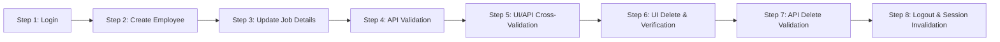

# OrangeHRM End-to-End Test Automation Framework

A production-grade, enterprise-ready UI & API test automation framework built with [Playwright](https://playwright.dev/) and [TypeScript](https://www.typescriptlang.org/), implementing the Page Object Model (POM) pattern for the [OrangeHRM Open Source Demo](https://opensource-demo.orangehrmlive.com/).

---

## Table of Contents

- [Architectural Overview](#architectural-overview)
- [Project Structure](#project-structure)
- [Key Engineering Decisions](#key-engineering-decisions)
- [End-to-End Workflow Under Test](#end-to-end-workflow-under-test)
- [API Integration & Hybrid Validation](#api-integration--hybrid-validation)
- [Prerequisites](#prerequisites)
- [Installation & Setup](#installation--setup)
- [Configuration & Environment Variables](#configuration--environment-variables)
- [Running Tests](#running-tests)
- [Test Reports & Video Artifacts](#test-reports--video-artifacts)
- [Continuous Integration (CI/CD)](#continuous-integration-cicd)
- [Code Quality & Linting](#code-quality--linting)

---

## Architectural Overview

This framework is designed according to industry best practices for scalability, maintainability, and resilience:

- **Page Object Model (POM)**: Web pages and complex UI components are encapsulated into dedicated page classes. Selectors and interactions are decoupled from test specifications.
- **Strict-Mode Compliant Locators**: Built using resilient locator strategies (accessible roles, label-associated input groups, and scoped text filters) that eliminate flakiness and strict-mode violations.
- **Dynamic & Collision-Resistant Data Management**: Unique employee identities are procedurally generated per run using timestamped identifiers (`AUT` + `HHmm` + 3-digit random suffix) combined with realistic data pools.
- **Network Synchronization**: Dynamic network response waiting (`waitForResponse` with query param verification) is paired with UI assertions to avoid race conditions against Vue reactivity and client-side rendering.
- **Hybrid UI/API Automation**: Integrates Playwright's native `APIRequestContext` to validate complete CRUD lifecycles, demonstrating modern dual-layer testing patterns.
- **Rich Diagnostic Artifacts**: Playwright HTML reports, automatic video recordings (`video: 'on'`), and trace zip archives captured on retries/failures.

---

## Project Structure

```
.
├── .github/
│   └── workflows/
│       └── playwright.yml         # GitHub Actions CI pipeline
├── api/
│   └── EmployeeApiClient.ts       # Typed API client for CRUD lifecycle & cross-validation
├── assets/
│   └── profile-picture.jpg        # Fixture image for profile picture upload
├── config/
│   └── environment.ts             # Strongly-typed environment configuration & validation
├── fixtures/
│   ├── employeeData.json          # Pre-configured baseline employee fixtures
│   └── testData.ts                # Test data provider & collision-free factory
├── pages/
│   ├── AddEmployeePage.ts         # Add Employee page object (form inputs & photo upload)
│   ├── DashboardPage.ts           # Dashboard page object (navigation & session logout)
│   ├── EmployeeDetailsPage.ts     # Personal & Job Details page object (dropdowns & tabs)
│   ├── LoginPage.ts               # Login page object (authentication & error assertions)
│   └── PimPage.ts                 # PIM Employee List page object (search, delete & table assertions)
├── tests/
│   └── employee-lifecycle.spec.ts # Complete end-to-end employee lifecycle test suite
├── utils/
│   ├── constants.ts               # App routes, timeouts, dropdown options & assertions messages
│   ├── dataGenerator.ts           # Collision-resistant test data generator
│   └── logger.ts                  # Standardized structured console logger
├── .env                           # Local environment secrets (not committed to public repos)
├── .env.example                   # Template for environment configuration
├── .prettierrc                    # Prettier formatting configuration
├── eslint.config.mjs              # ESLint flat config with TypeScript parser
├── package.json                   # Project dependencies and test execution scripts
├── playwright.config.ts           # Playwright runner configuration (reporters, viewports, artifacts)
└── tsconfig.json                  # TypeScript compiler configuration (strict mode & path aliases)
```

---

## Key Engineering Decisions

1. **Scoped `.oxd-input-group` Selectors**: OrangeHRM renders complex grids inside `.oxd-form-row` wrappers containing multiple inputs. Rather than using brittle indexes or global classes, our locators anchor to `.oxd-input-group` filtered by internal `<label>` text.
2. **Network Response Synchronized Actions**: OrangeHRM PIM Employee List triggers background `GET /api/v2/pim/employees` requests on page load. Search filters specifically await responses containing `employeeId=${id}`, preventing race conditions where stale results are captured.
3. **Targeted Row Actions**: Deletion targets the specific row matching the dynamically generated `employeeId`, preventing unintended deletions in shared demo environments.
4. **Resilient Dropdown Component Interaction**: OrangeHRM uses custom Vue select boxes (`.oxd-select-text`). The framework handles opening the listbox, waiting for option visibility, and asserting values using `.toContainText()` to remain robust against embedded icon glyphs.

---

## End-to-End Workflow Under Test

The test suite (`tests/employee-lifecycle.spec.ts`) verifies the entire employee management lifecycle across 8 distinct, traceable test steps:



1. **Step 1: Login**: Validates login page elements, authenticates with valid credentials, and asserts dashboard heading visibility.
2. **Step 2: Add Employee**: Navigates to PIM → Add Employee, fills in dynamic first name, last name, and unique employee ID, uploads a profile picture, saves, and verifies redirection to Personal Details.
3. **Step 3: Update Job Details**: Navigates to the Job tab, updates Job Title (e.g., Software Engineer) and Employment Status (e.g., Full-Time Permanent), saves changes, verifies success toast notification, reloads the page, and asserts persistence.
4. **Step 4: API CRUD Validation**: Executes `POST`, `GET`, and `PUT` requests via `EmployeeApiClient`, verifying status codes (201, 200) and response payload shapes.
5. **Step 5: Cross-Validation**: Compares UI-entered state against API responses to validate cross-layer data integrity.
6. **Step 6: Delete Employee**: Searches for the employee by ID, verifies presence in table, triggers deletion from the target row, confirms the dialog, verifies success notification, and asserts absence ("No Records Found").
7. **Step 7: API Deletion Validation**: Executes `DELETE` (204 No Content) and verifies resource non-existence via 404 response handling.
8. **Step 8: Logout & Session Invalidation**: Logs out via the user dropdown, verifies redirection to login, attempts to navigate back to the protected `/dashboard` URL, and verifies automatic redirection back to `/auth/login`.

---

## API Integration & Hybrid Validation

OrangeHRM Open Source Demo does not expose a public, authenticated CRUD REST API for external third-party testing. To fulfill the technical assessment's requirement for API integration and cross-validation:

- The framework incorporates `EmployeeApiClient`, utilizing Playwright's native `APIRequestContext`.
- The client connects to `https://reqres.in/api` as a simulated API backend for contract testing.
- The client models typed request and response interfaces for `createEmployee`, `getEmployee`, `updateEmployee`, and `deleteEmployee`.
- Dual-layer assertions verify status codes (`201 Created`, `200 OK`, `204 No Content`, `404 Not Found`) and confirm attribute parity between the UI employee and API employee records.

### ReqRes Rate Limits & the Optional API Key

ReqRes's anonymous tier caps unauthenticated traffic at **40 requests/day per IP**, resetting at midnight UTC. Each full test run uses **5 requests** (`POST`, `GET`, `PUT`, `DELETE`, `GET`), so:

| Scenario                           | Behavior                                                                                                                                                                                                    |
| ---------------------------------- | ----------------------------------------------------------------------------------------------------------------------------------------------------------------------------------------------------------- |
| **No API key set**                 | Works out of the box — up to **8 full runs/day** on the free anonymous quota. `EmployeeApiClient` also logs a warning once fewer than 10 requests remain, so you get advance notice before hitting the cap. |
| **`REQRES_API_KEY` set in `.env`** | Requests are sent with an `x-api-key` header, raising the daily limit well beyond the anonymous tier — safe for CI, repeated demo runs, or grading re-runs the same day.                                    |

To add a key: sign up for free at [app.reqres.in/sign-up](https://app.reqres.in/sign-up), copy your API key from the dashboard, and set it in `.env`:

```bash
REQRES_API_KEY=your_key_here
```

If the daily quota is ever fully exhausted (e.g. from many consecutive runs without a key), the affected API assertion fails with a clear `429` status message rather than hanging or retrying pointlessly — the client only retries when the response advertises a short `Retry-After` window; the daily cap does not, so it fails fast instead of wasting time on retries that can't succeed.

---

## Prerequisites

- **Node.js**: `v18.0.0` or higher (`v20+` recommended)
- **npm**: `v9.0.0` or higher
- **Internet Access**: Required to connect to the OrangeHRM demo instance and ReqRes API.

---

## Installation & Setup

1. **Clone the repository:**

   ```bash
   git clone <repository-url>
   cd autotest
   ```

2. **Install dependencies:**

   ```bash
   npm install
   ```

3. **Install Playwright browser binaries:**

   ```bash
   npx playwright install --with-deps chromium
   ```

4. **Set up environment variables:**

   ```bash
   cp .env.example .env
   ```

   The defaults already point at the public OrangeHRM demo and ReqRes, so the suite runs with **no further edits required**. Optionally add a free `REQRES_API_KEY` (see [API Integration & Hybrid Validation](#api-integration--hybrid-validation)) to raise the API rate limit.

---

## Configuration & Environment Variables

Environment variables are loaded via `dotenv` and strongly typed via `config/environment.ts`:

| Variable             | Description                                               | Default Value                               |
| -------------------- | --------------------------------------------------------- | ------------------------------------------- |
| `ORANGEHRM_BASE_URL` | Base URL of the OrangeHRM instance                        | `https://opensource-demo.orangehrmlive.com` |
| `ORANGEHRM_USERNAME` | Admin login username                                      | `Admin`                                     |
| `ORANGEHRM_PASSWORD` | Admin login password                                      | `admin123`                                  |
| `API_BASE_URL`       | Base URL for API validation                               | `https://reqres.in/api`                     |
| `REQRES_API_KEY`     | Optional. Raises the ReqRes daily request cap (see above) | _(empty — anonymous tier)_                  |
| `CI`                 | Automatically set in CI environments                      | `false`                                     |

---

## Running Tests

### Run all tests in headless mode (recommended, ~25-30s):

No visible browser window; fastest option and what CI uses.

```bash
npm test
```

### Run tests in headed (visible browser) mode (~50-60s):

Watch the browser drive OrangeHRM through all 8 steps live. Slower than headless because rendering a visible, composited window costs real time — this is expected, not a performance issue.

```bash
npm run test:headed
```

### Run tests with interactive Playwright Inspector (debugging):

Step through actions one at a time, inspect locators, and time-travel through the run.

```bash
npm run test:debug
```

### Run in Playwright's UI mode (visual timeline, watch mode):

```bash
npx playwright test --ui
```

Every mode prints structured, timestamped step logs (`[AutoTest] 🔹 STEP: ...`) to the console as the run progresses, so pass/fail status and API responses are visible without opening the report.

---

## Test Reports & Video Artifacts

### HTML Report

Every execution generates a self-contained Playwright HTML report in `playwright-report/`. After any test run, open it with:

```bash
npm run test:report
```

This opens an interactive page in your browser at `http://localhost:9323`. Click into the test to expand:

- Per-step timing and execution status (green ✓ per step, matching the 8 steps above)
- Full structured console log output (`[AutoTest]` step markers, API request/response lines)
- Interactive DOM snapshots at each action
- Embedded video playback of the run
- On failure only: screenshot at the point of failure and a downloadable trace (`npx playwright show-trace <path>`) for step-by-step replay with network and DOM inspection

The report is self-contained under `playwright-report/` — it can be zipped and shared, or attached to a CI artifact, without re-running anything.

### Video Recording

Video capture is configured to record every test execution (`video: 'on'` in `playwright.config.ts`):

- Video recordings are saved in: `test-results/<test-run-directory>/video.webm`
- Videos can be viewed in any standard media player or directly inside the Playwright HTML report.

---

## Continuous Integration (CI/CD)

The framework includes an enterprise GitHub Actions workflow (`.github/workflows/playwright.yml`):

- Triggers on every `push` and `pull_request` to `main` and `master`.
- Runs on Ubuntu latest with Node.js 20.
- Executes `npm run lint`, `npm run typecheck`, and `npm test` sequentially.
- Automatically archives and uploads both the **Playwright HTML Report** (`playwright-report/`) and **Test Results / Videos** (`test-results/`) as GitHub Actions build artifacts (retained for 30 days).

---

## Code Quality & Linting

To maintain clean code standards:

```bash
# Run ESLint check
npm run lint

# Run TypeScript type validation
npm run typecheck

# Check formatting with Prettier
npm run format:check

# Auto-format codebase with Prettier
npm run format
```
